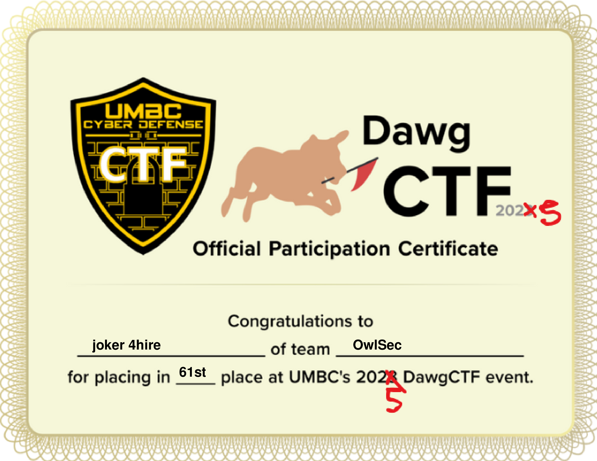

<div align="center">
  
  
  # 👋 Hey, I'm **Joker**  
  **Cybersecurity Enjoyer • Low‑Level C Wizard • Web Development Explorer**

  [](https://github.com/ridjan-xhika)  
  [](https://github.com/ridjan-xhika?tab=followers)  
  [](https://github.com/ridjan-xhika?tab=repositories)  
  [](https://www.epitech.eu/)
</div>

---

## 🚀 About Me

Hey there! I'm an **Epitech Student** with an insatiable curiosity for cybersecurity and a deep love for low‑level programming in **C**. I believe in creating elegant solutions to complex problems while maintaining a playful approach to technology.

- 🔭 **Currently Working On:**  
  - Advanced web security auditing tools  
  - A Discord‑inspired secure messenger
- 🌱 **Expanding Knowledge In:**  
  - Kernel exploitation  
  - React state management  
  - CI/CD workflows
- 🎯 **2025 Goals:**  
  - Contribute to 5+ open‑source security projects  
  - Launch my secure messenger app
- ⚡ **Superpower:** Debugging complex C code at 3 AM with perfect sanity!

<div align="center">
  
</div>

---

## 🛠️ Technologies & Tools

<div align="center">
| **Languages**  | **Frameworks & Libraries** | **Security Tools**      | **DevOps & Tools** |
|:--------------:|:--------------------------:|:-----------------------:|:------------------:|
| C, JavaScript, Python, Bash | React, Node.js, Express, MongoDB | Kali Linux, Wireshark, Metasploit, Burp Suite | Git, Docker, Linux, VS Code |
</div>

---

## 📊 GitHub Stats

<div align="center">
  
  
</div>

<br>

<div align="center">
  
</div>

---

## 🏆 Certificates & Badges

-   
-   
-   
- 

---

## 🐍 Contribution Snake

<div align="center">
  <picture>
    <source media="(prefers-color-scheme: dark)" srcset="https://raw.githubusercontent.com/platane/platane/output/github-contribution-grid-snake-dark.svg">
    <source media="(prefers-color-scheme: light)" srcset="https://raw.githubusercontent.com/platane/platane/output/github-contribution-grid-snake.svg">
    
  </picture>
</div>

> 🔧 **To implement this on your profile:**  
> Fork [platane/snk](https://github.com/platane/snk) and follow the setup instructions.

---

## 💡 Featured Projects

<div align="center">
  [](https://github.com/ridjan-xhika/secure-messenger)
  [](https://github.com/ridjan-xhika/vulnerability-scanner)
</div>

---

## 🧠 Weekly Coding Breakdown

```text
C          █████████░░░░░  65%
JavaScript ██████░░░░░░░░  40%
Python     ███████████░░░  85%
Bash       ███░░░░░░░░░░░  15%
React      ██████░░░░░░░░  40%
````

<details>
  <summary>🔍 Productivity Secrets</summary>
  <ul>
    <li>🌙 <b>Nighttime Coding:</b> Peak performance after midnight</li>
    <li>☕ <b>Caffeine Protocol:</b> Espresso every 3 hours</li>
    <li>🎵 <b>Music:</b> Synthwave for debugging, lo‑fi for features</li>
    <li>📝 <b>Problem‑Solving:</b> Sketch solutions on paper first</li>
  </ul>
</details>

---

## 🎧 Vibing To

<div align="center">
  [](https://open.spotify.com/playlist/3JLumy2swYlmKDqjeTv5R7)
</div>

---

## 🌐 Connect With Me

<div align="center">
  <a href="https://linkedin.com/in/ridjan-xhika-8a0a312ab">
    
  </a>
  <a href="https://twitter.com/Lost_Jokerr">
    
  </a>
  <a href="https://ridjan-xhika.github.io/portfolio/">
    
  </a>
  <a href="mailto:ridjan.xhika@epitech.eu">
    
  </a>
  <a href="https://discord.gg/yourdiscord">
    
  </a>
</div>

---

## 🤝 Let's Collaborate!

I’m always open to interesting projects—especially in cybersecurity and web innovation. Feel free to reach out!

<div align="center">
  
  <blockquote>“Code is like humor. When you have to explain it, it's bad.” – Cory House</blockquote>
</div>

---

<div align="center">
  
</div>
```

## 📊 GitHub Stats

<div align="center">
  
  
</div>

---

## 🏆 Achievements & Certifications

- **DawgCTF 2025** – Winner (Certificate)
- TryHackMe: Top 1% challenger
- HackTheBox: Advanced-level hacker
- Elite CTF Player on CTFtime

---

## 🧩 Featured Projects

| Project                | Description                                | Repo                                           |
| ---------------------- | ------------------------------------------ | ---------------------------------------------- |
| Secure Messenger       | End-to-end encrypted chat application      | [GitHub](https://github.com/ridjan-xhika/secure-messenger) |
| Vulnerability Scanner  | Automated web vulnerability scanning tool  | [GitHub](https://github.com/ridjan-xhika/vulnerability-scanner) |

---

## 🌐 Connect

[](https://linkedin.com/in/ridjan-xhika-8a0a312ab) 
[](https://twitter.com/Lost_Jokerr)

> "Code is like humor. When you have to explain it, it's bad." – Cory House
