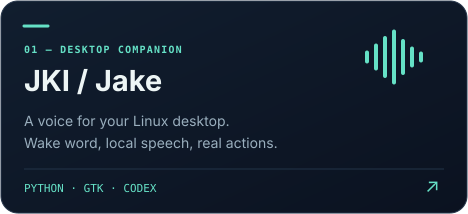
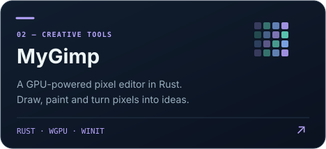
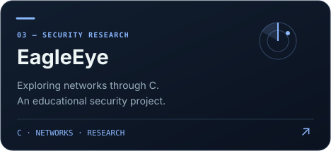
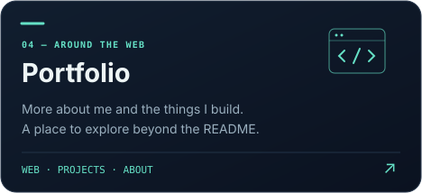
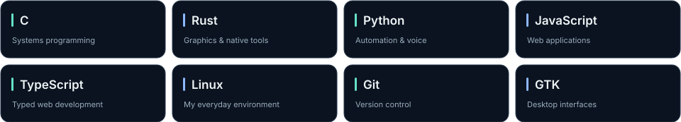
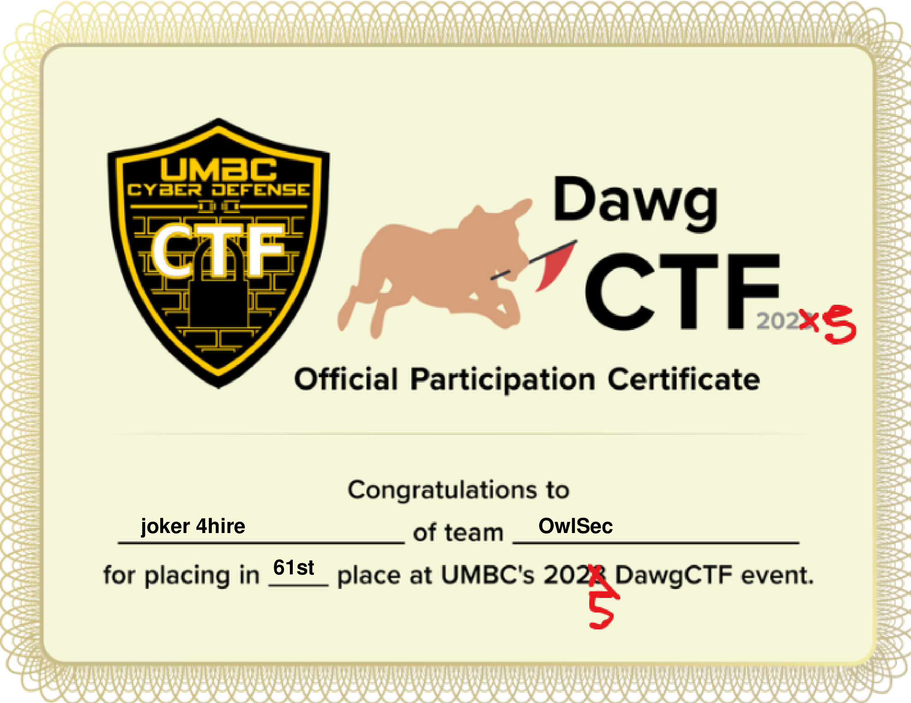
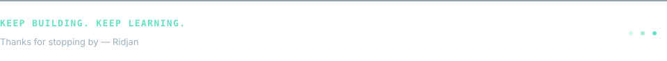

  <a href="https://ridjan-xhika.github.io/portfolio/"><strong>Portfolio&nbsp;↗</strong></a> ·
  <a href="https://linkedin.com/in/ridjan-xhika-8a0a312ab"><strong>LinkedIn&nbsp;↗</strong></a> ·
  <a href="https://github.com/ridjan-xhika?tab=repositories"><strong>Projects&nbsp;↗</strong></a>

**Software that does something useful. Security that starts with understanding.**

## A little about me

I’m **Ridjan**, an Epitech student exploring the space between **systems programming, cybersecurity, and useful applications**. I like following an idea all the way down: from the interface someone clicks to the code and operating system underneath it.

My projects range from a Rust pixel editor to a voice companion for Linux. CTFs give me another way to learn: inspect a problem, test an idea, and keep digging until the pieces make sense.

| On my desk | What draws me in |
| :--- | :--- |
| **Building JKI / Jake** | Local speech recognition, desktop controls, and a voice interface for Codex. |
| **Exploring systems** | C, Rust, Linux, and understanding what happens behind an abstraction. |
| **Learning through CTFs** | Reverse engineering, security puzzles, and practical problem solving. |
| **Outside the terminal** | Anime soundtracks, music on repeat, and ideas for the next project. |

## Things I’ve been building

  
  

  
  

**Currently in focus — JKI.** Say “Jake,” give a command, and get a spoken reply. It brings together local Vosk and Whisper recognition, Piper speech, an animated GTK orb, desktop and music controls, and selectable Codex models and reasoning levels. [Explore the project →](https://github.com/ridjan-xhika/JKI)

## My toolkit

<picture>
  <source media="(max-width: 600px)" srcset="assets/toolkit-mobile.svg" />
  
</picture>

I choose tools around the problem: **C and Rust** when I want to work close to the system, **Python** for automation and experiments, and **JavaScript / TypeScript** for the web. Linux is where it all comes together.

## Press play, then build

[**Listen on Spotify ↗**](https://open.spotify.com/playlist/37i9dQZF1DXdBREWaHui4o) · Featured playlist: **Best of Anime Now 2025**, curated by Spotify. Playback opens in Spotify.

## One contribution at a time

<picture>
  <source media="(prefers-color-scheme: dark)" srcset="assets/github-contribution-grid-snake-dark.svg" />
  <source media="(prefers-color-scheme: light)" srcset="assets/github-contribution-grid-snake.svg" />
  
</picture>

Small experiments, fixes, and projects add up. This contribution trail refreshes every day.

<strong>CTF notebook — DawgCTF 2025 participation certificate</strong>

 

An existing keepsake from DawgCTF 2025. Another opportunity to learn by working through security challenges.

[View the certificate as a PDF →](assets/DawgCTF_2025_Certificate.pdf)

## Let’s connect

Working on desktop tools, systems code, or security challenges? I’m always interested in exchanging ideas and learning from how other people build.

[**Find me on LinkedIn**](https://linkedin.com/in/ridjan-xhika-8a0a312ab) · [**Explore my portfolio**](https://ridjan-xhika.github.io/portfolio/) · [**Browse my code**](https://github.com/ridjan-xhika?tab=repositories)

